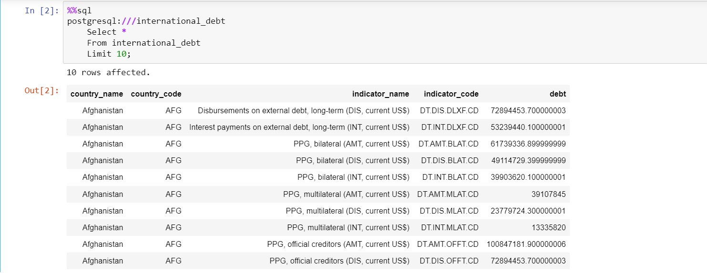
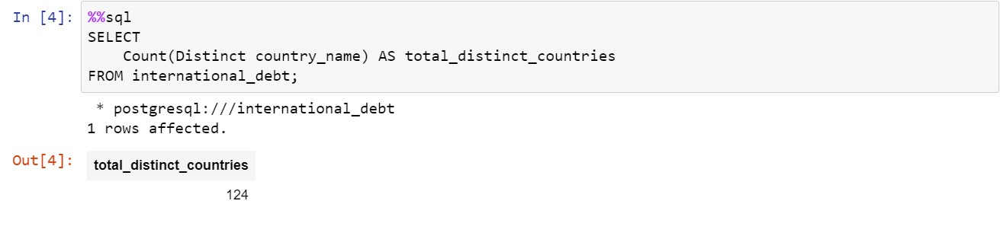
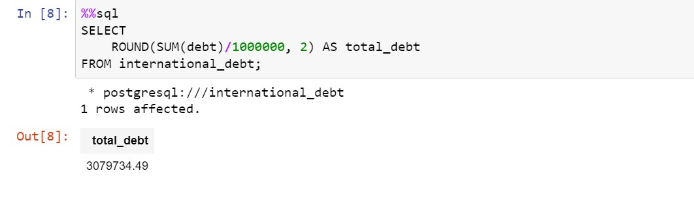
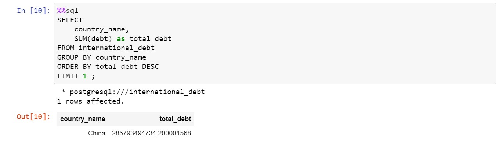
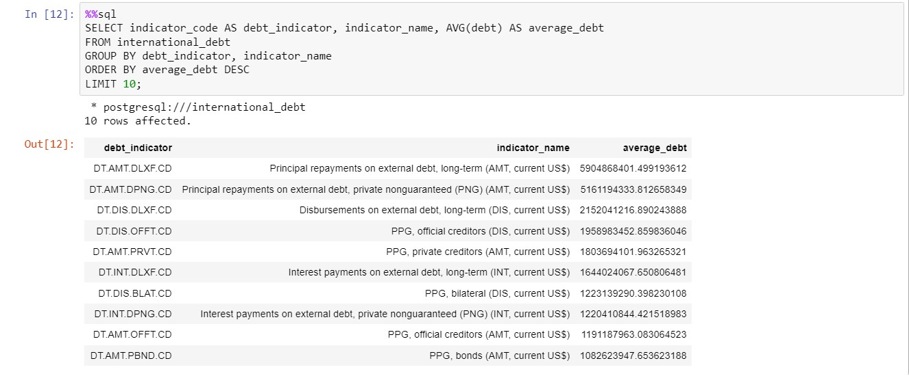
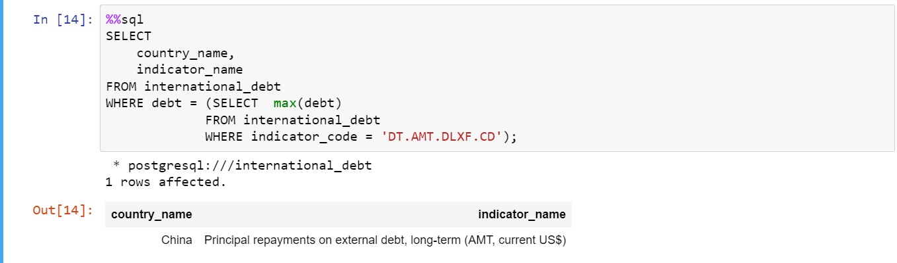
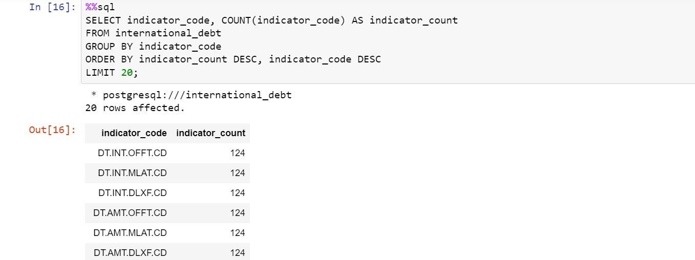
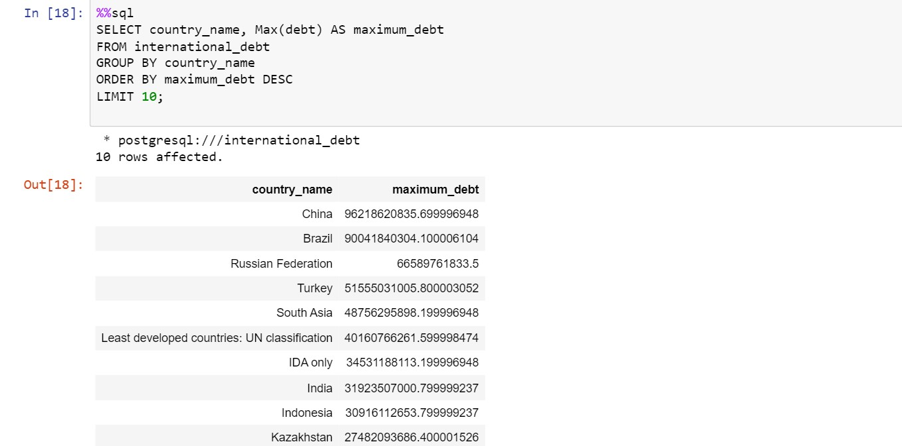

# Analyze International Debt Statistics

## Introduction
In this project, I analyzed international debt data collected by The World Bank. 
The dataset contains information about the amount of debt (in USD) owed by developing countries across several categories. 

## Objectives
In this project, I analyzed international debt data collected by The World Bank. The dataset contains information about the amount of debt (in USD) owed by developing countries across several categories. You are going to find the answers to questions like:

- What is the total amount of debt that is owed by the countries listed in the dataset?
- Which country owns the maximum amount of debt and what does that amount look like?
- What is the average amount of debt owed by countries across different debt indicators?

## 1) The World Bank's international debt data
The first line of code connects us to the international_debt database where the table international_debt is residing. Also, we'll limit the output to the first ten rows to keep the output clean

## 2) Finding the number of distinct countries
From the first ten rows, we can see the amount of debt owed by Afghanistan in the different debt indicators. But we do not know the number of different countries we have on the table. There are repetitions in the country names because a country is most likely to have debt in more than one debt indicator.

Without a count of unique countries, we will not be able to perform our statistical analyses holistically. In this section, I extracted the number of unique countries present in the table.

## 3) Finding the number of distinct countries
From the first ten rows, we can see the amount of debt owed by Afghanistan in the different debt indicators. But we do not know the number of different countries we have on the table. There are repetitions in the country names because a country is most likely to have debt in more than one debt indicator.

Without a count of unique countries, we will not be able to perform our statistical analyses holistically. In this section, I extracted the number of unique countries present in the table.

## 4) Totaling the amount of debt owed by the countries
As mentioned earlier, the financial debt of a particular country represents its economic state. But if we were to project this on an overall global scale, how would we approach it?

Let's switch gears from the debt indicators now and find out the total amount of debt (in USD) that is owed by the different countries. This will give us a sense of how the overall economy of the entire world is holding up.

## 5) Country with the highest debt
Now that we have the exact total of the amounts of debt owed by several countries, let's find out the country that owns the highest amount of debt along with the amount. 
Note that this debt is the sum of different debts owed by a country across several categories. This will help to understand more about the country in terms of its socio-economic scenarios. 

## 6) Average amount of debt across indicators
We now have a brief overview of the dataset and a few of its summary statistics. We already have an idea of the different debt indicators in which the countries owe their debts. 
I dug even further to find out on average how much debt a country owes. This will give us a better sense of the distribution of the amount of debt across different indicators.

## 7) The highest amount of principal repayments
We can see that the indicator DT.AMT.DLXF.CD tops the chart of average debt. This category includes repayment of long-term debts. Countries take on long-term debt to acquire immediate capital.
An interesting observation in the above finding is that there is a huge difference in the amounts of the indicators after the second one. This indicates that the first two indicators might be the most severe categories in which the countries owe their debts.
I investigated this a bit more to find out which country owes the highest amount of debt in the category of long-term debts (DT.AMT.DLXF.CD). Since not all countries suffer from the same kind of economic disturbances, this finding will allow us to understand that particular country's economic condition a bit more specifically.

## 8) The most common debt indicator
We saw that long-term debt is the topmost category when it comes to the average amount of debt. 
But is it the most common indicator in which the countries owe their debt?

## 9) Other viable debt issues and conclusion
There are a total of six debt indicators in which all the countries listed in our dataset have taken debt. The indicator DT.AMT.DLXF.CD is also there on the list. So, this gives us a clue that all these countries are suffering from a common economic issue. But that is not the end of the story, but is just a part of the story.

In this notebook, I took a look at debt owed by countries across the globe. I extracted a few summary statistics from the data and unraveled some interesting facts and figures. I also validated our findings to make sure the investigations were correct.

## Conclusion

In this project, we analyzed international debt data from The World Bank to address key questions regarding debt magnitude and distribution among developing countries. 

We determined the total debt owed, identified the country with the highest debt, and calculated the average debt across different indicators. This analysis provides valuable insights for policymakers and stakeholders to better understand global debt dynamics and make informed decisions to support sustainable economic growth.
